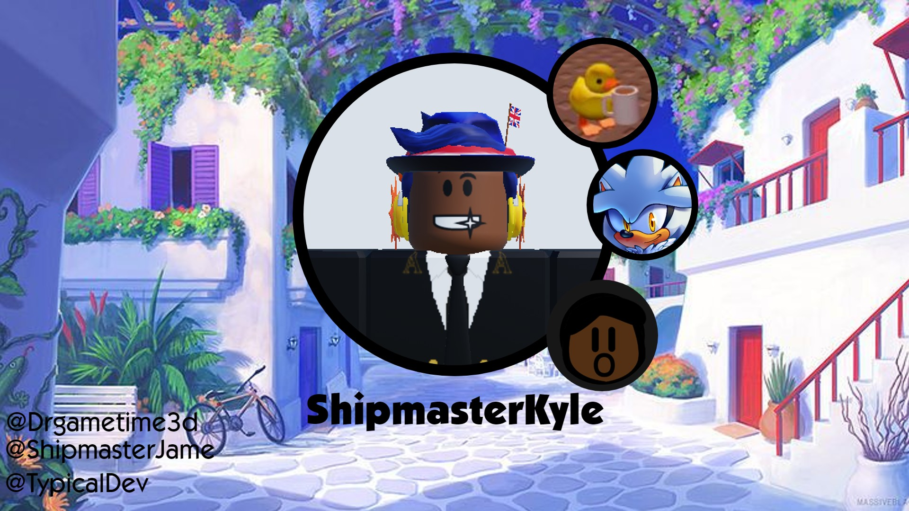

# Hello! It is I, the great ShipmasterKyle

I'm a programmer that works on a lot of Roblox and Scratch related projects.

I'm also [@ShipmasterJame](https://github.com/ShipmasterJame) <-- The account I use to upload stuff from vsc. Sometimes my commits come from here.

I own Silver Team, a roblox group that makes Sonic Earth and HedgeBurst Engine and Cubix an Organization created to make a powerful console to run Scratch Games. 

### Cool Projects
1. [Crouton](https://github.com/dnschneid/crouton) - Brings Linux Operating Systems to ChromeOS.
2. [Yesnt](https://github.com/SheepTester/yesnt) - A funny SheepTester (Sean) game where you have to escape the "YES" program.
3. [StudioCLI](https://github.com/R0bl0x10501050/StudioCLI) - A Command Line Interface for Roblox Studio

### My Work
1. [Chao Engine](https://github.com/ShipmasterKyle/Chao-Engine) - The first fully functional Chao Garden in Roblox
2. [SN-Edit](https://github.com/Cubix-Dev/SN-Edit) - The Offical Editor for Cube Enix's SNext
3. [Hedgeburst Engine](https://www.roblox.com/library/8261922963/ShipmasterKyles-HedgeBurst-Engine-v3-6) - The Physics Engine for Sonic Earth
4. [The RealTime Framework](https://github.com/ShipmasterKyle/RobloxMMR) - A set of working band tools that allow you to actually play your instruments in game.
5. [SNext](https://github.com/Cubix-Firmware/SNext) - A Console written in NodeJS that runs Scratch Games
6. [Legends](https://github.com/ShipmasterKyle/Legends) - A Pokemon Based math game developed originally as a school project thats recently seen a fresh coat of paint.
7. [GumLights](https://marketplace.visualstudio.com/items?itemName=Cubix.gumlights) - The official text highlights for the Gum on VSCode

### Contact
Want to commission me to work on your project or just want to talk?

- Discord: @shipmasterkyle2
- Roblox: Drgametime3d
- Scratch: Drgametime3d
